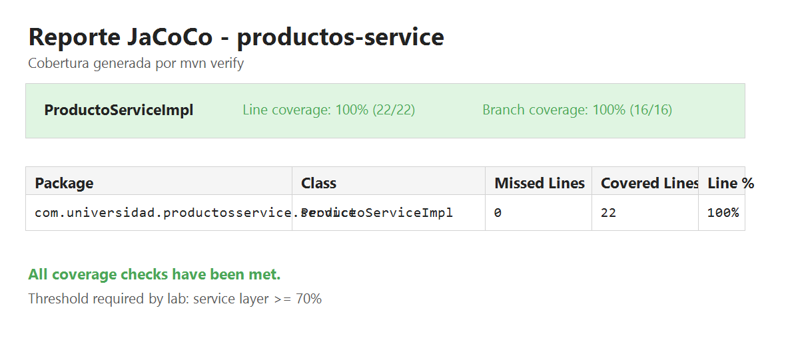
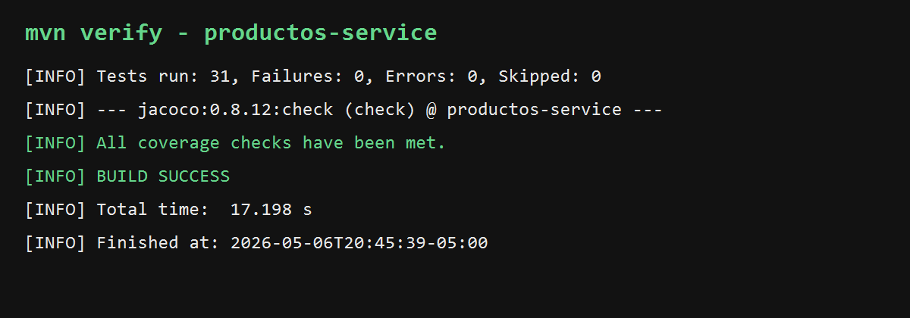
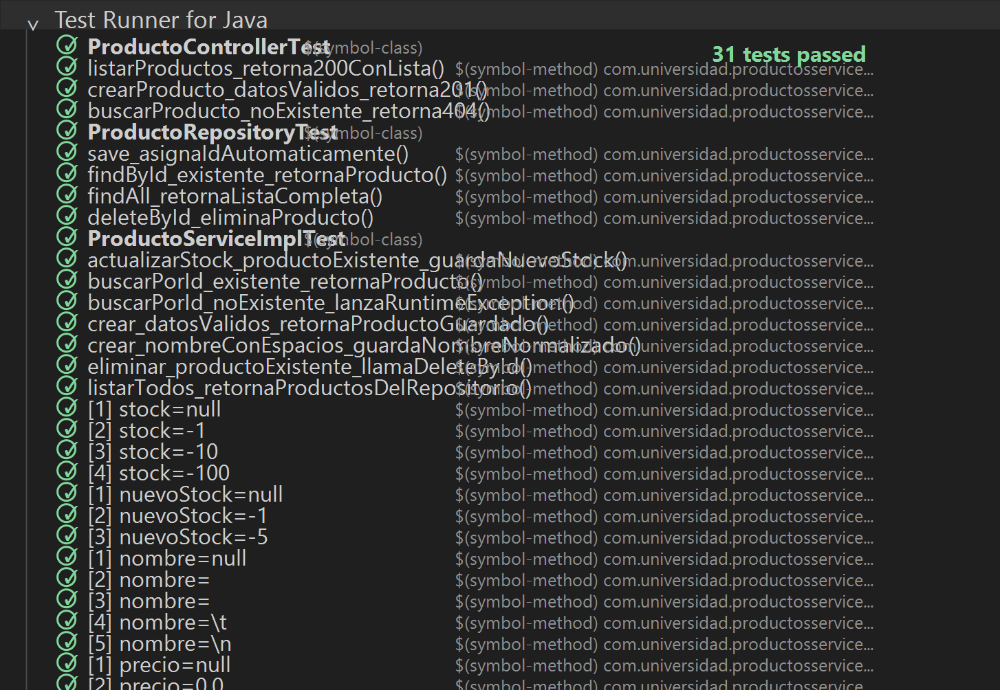

# Productos Service


Microservicio Spring Boot para gestion de productos, desarrollado para la Unidad 9. Incluye pruebas unitarias, pruebas de integracion JPA, pruebas web MVC y pipeline de CI con reporte JaCoCo.

## Proyecto

El codigo fuente esta en `productos-service/` y usa:

- Java 21
- Maven 3.9+
- Spring Boot 3.3.13
- Spring Web
- Spring Data JPA
- H2 Database
- Lombok
- JUnit 5
- Mockito
- JaCoCo
- GitHub Actions

## Estructura

```text
.github/workflows/ci.yml
README.md
productos-service/
  src/main/java/com/universidad/productosservice/
    ProductosServiceApplication.java
    controller/ApiExceptionHandler.java
    controller/ProductoController.java
    domain/Producto.java
    repository/ProductoRepository.java
    service/ProductoService.java
    service/ProductoServiceImpl.java
  src/test/java/com/universidad/productosservice/
    controller/ProductoControllerTest.java
    repository/ProductoRepositoryTest.java
    service/ProductoServiceImplTest.java
  src/test/resources/application-test.properties
  docs/
    jacoco-report.png
    mvn-test-build-success.png
    mvn-verify-output.txt
    test-runner-java.png
```

## Funcionalidad

El servicio implementa reglas de negocio para crear productos, listar todos, buscar por id, actualizar stock y eliminar productos existentes. Las validaciones lanzan `IllegalArgumentException` cuando los datos son invalidos y el controlador responde `404 Not Found` cuando un producto no existe.

Endpoints principales:

```text
GET    /api/productos
POST   /api/productos
GET    /api/productos/{id}
PATCH  /api/productos/{id}/stock
DELETE /api/productos/{id}
```

## Pruebas

La suite incluye:

- `ProductoServiceImplTest`: pruebas unitarias con `@Mock`, `@InjectMocks`, pruebas parametrizadas y `ArgumentCaptor`.
- `ProductoRepositoryTest`: pruebas de persistencia con `@DataJpaTest`, H2 y aislamiento con `@BeforeEach`.
- `ProductoControllerTest`: pruebas web con `@WebMvcTest`, `MockMvc` y servicio simulado con `@MockBean`.

## Ejecucion

Desde la carpeta del servicio:

```bash
cd productos-service
mvn test
mvn verify
```

`mvn verify` ejecuta todas las pruebas y genera el reporte JaCoCo en:

```text
productos-service/target/site/jacoco/index.html
```

## Cobertura

JaCoCo valida por build que la capa `com.universidad.productosservice.service` tenga al menos 70% de cobertura. En la ejecucion actual, `ProductoServiceImpl` tiene 100% de lineas cubiertas.



## CI/CD

El workflow [.github/workflows/ci.yml](.github/workflows/ci.yml) ejecuta en cada `push` o `pull_request` hacia `main`:

- Checkout del repositorio.
- Configuracion de JDK 21.
- `mvn -B verify --no-transfer-progress` dentro de `productos-service`.
- Publicacion del artefacto `jacoco-report`.

## Evidencia





Resumen de la ultima ejecucion:

```text
Tests run: 31, Failures: 0, Errors: 0, Skipped: 0
All coverage checks have been met.
BUILD SUCCESS
```
